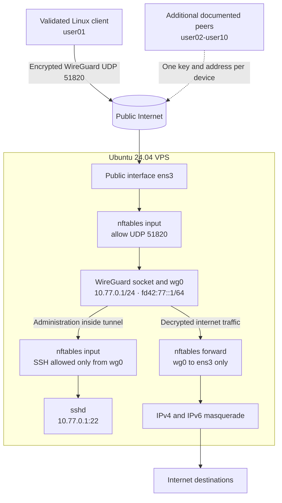

# Private WireGuard VPN on a VPS for 10 Users

**English** | [Русский](README.ru.md)

An end-to-end runbook for Ubuntu 24.04 LTS covering VPS provisioning, protected SSH access, dual-stack routing, an `nftables` firewall, WireGuard, Linux clients, and iPhone onboarding.

## Outcome

The completed design looks like this:



There is intentionally no forwarding path from one VPN client to another. The diagram distinguishes the validated `user01` deployment from the additional peers documented by the runbook.

The examples use:

- `203.0.113.10` as a documentation-only server address; replace it with the real VPS IPv4 address;
- `ens3` as an example public interface; the runbook detects the real interface;
- `ubuntu` as the administrative account;
- `user01` as the first Linux client;
- TCP 22 for SSH;
- UDP 51820 for WireGuard.

Never publish SSH private keys, WireGuard `private.key` files, preshared keys, QR codes, or complete client configuration files. Public keys are not secret.

## 1. VPS requirements

For approximately ten users, a reasonable starting point is:

- 1–2 vCPUs;
- 1–2 GB RAM;
- 20 GB SSD;
- a public IPv4 address;
- working public IPv6 if dual-stack VPN access is required;
- at least 200 Mbps network capacity;
- Ubuntu 24.04 LTS.

Traffic allowance and datacenter location are normally more important than RAM for this workload. The datacenter country becomes the apparent exit location of VPN traffic.

At the provider firewall, initially allow:

- TCP 22 for administration;
- UDP 51820 for WireGuard.

After validation, restrict TCP 22 to a trusted administrative IP whenever practical. Do not install cPanel, Plesk, a public VPN dashboard, or unrelated services unless they are required.

## 2. Create a protected SSH key

Run this section on the local administrator workstation.

Create a dedicated password-protected ED25519 key:

```bash
ssh-keygen \
  -t ed25519 \
  -a 64 \
  -f ~/.ssh/vpn_ovh_ed25519 \
  -C "vpn-ovh-admin"
```

Store the passphrase in a password manager. It protects the local key and is not the server password.

The command creates:

```text
~/.ssh/vpn_ovh_ed25519       private key — secret
~/.ssh/vpn_ovh_ed25519.pub   public key
```

Validate the private key and passphrase:

```bash
ssh-keygen -y -f ~/.ssh/vpn_ovh_ed25519 >/dev/null \
  && echo "SSH KEY OK"
```

Inspect the public fingerprint:

```bash
ssh-keygen -lf ~/.ssh/vpn_ovh_ed25519.pub
```

The public value has this form:

```text
ssh-ed25519 AAAA... vpn-ovh-admin
```

Copy the complete line into the provider control panel without editing it.

## 3. Provision or reinstall the VPS

In the provider control panel:

1. Add the public SSH key with a unique label such as `vpn-protected`.
2. Create a new VPS, or reinstall an empty VPS.
3. Select Ubuntu 24.04 LTS.
4. Explicitly select `vpn-protected` in the SSH key field.
5. Wait until installation is complete and the VPS reports `Running`.

Reinstallation erases the VPS. Only reinstall an empty system or a system whose required data has been backed up.

Adding a key to the provider account does not necessarily place it in an already-installed operating system. The key must be selected during provisioning or reinstallation.

## 4. First SSH connection

On the local workstation, define reusable variables:

```bash
export VPN_SERVER_IP="203.0.113.10"
export VPN_SSH_KEY="$HOME/.ssh/vpn_ovh_ed25519"
```

Connect while forcing SSH to offer only the requested identity:

```bash
ssh \
  -o IdentitiesOnly=yes \
  -i "$VPN_SSH_KEY" \
  "ubuntu@$VPN_SERVER_IP"
```

On the first connection, verify the host fingerprint through a trusted provider channel if available, then accept it. Enter the local key passphrase.

Validate the account and operating system:

```bash
whoami
lsb_release -ds
sudo true && echo "sudo OK"
```

Expected results are the `ubuntu` account, Ubuntu 24.04 LTS, and `sudo OK`.

## 5. Update the server and install packages

Commands now run on the VPS unless stated otherwise.

```bash
sudo apt update
sudo apt upgrade -y
sudo apt install -y wireguard wireguard-tools nftables qrencode
sudo reboot
```

Reconnect after the reboot and verify the tools:

```bash
wg --version
nft --version
```

## 6. Inspect networking and existing firewall state

Detect the public interface:

```bash
WAN_IF="$(ip -4 route show default | awk '{print $5; exit}')"
printf 'WAN interface: %s\n' "$WAN_IF"
```

Verify the IPv6 default route:

```bash
ip -6 route show default
```

Detect the effective SSH port:

```bash
SSH_PORT="$(sudo sshd -T | awk '$1 == "port" {print $2; exit}')"
printf 'SSH port: %s\n' "$SSH_PORT"
```

Inspect existing firewall tools:

```bash
sudo ufw status verbose
sudo nft list ruleset
sudo iptables -S
```

This runbook assumes a new VPS where UFW reports `inactive`, no meaningful nftables rules exist, and the base iptables policies are `ACCEPT`. Do not overwrite an existing firewall without reviewing and migrating its rules.

## 7. Enable IPv4 and IPv6 forwarding

Detect the interface again in case this is a new SSH session:

```bash
WAN_IF="$(ip -4 route show default | awk '{print $5; exit}')"
```

Create persistent kernel settings:

```bash
sudo tee /etc/sysctl.d/70-wireguard-routing.conf >/dev/null <<EOF
net.ipv4.ip_forward = 1
net.ipv6.conf.all.forwarding = 1
net.ipv6.conf.${WAN_IF}.accept_ra = 2
EOF
```

`accept_ra = 2` preserves Router Advertisement processing on an interface that also performs IPv6 forwarding.

Apply and verify:

```bash
sudo sysctl --system
sysctl net.ipv4.ip_forward
sysctl net.ipv6.conf.all.forwarding
ip -6 route show default
```

Both forwarding values must be `1`, and the IPv6 default route must remain present.

## 8. Configure nftables

Detect the current values again:

```bash
WAN_IF="$(ip -4 route show default | awk '{print $5; exit}')"
SSH_PORT="$(sudo sshd -T | awk '$1 == "port" {print $2; exit}')"
printf 'WAN=%s SSH_PORT=%s\n' "$WAN_IF" "$SSH_PORT"
```

Create `/etc/nftables.conf`. The shell expands the interface and SSH port variables:

```bash
sudo tee /etc/nftables.conf >/dev/null <<EOF
#!/usr/sbin/nft -f

flush ruleset

table inet vpn_filter {
    chain input {
        type filter hook input priority filter
        policy drop

        ct state invalid drop
        ct state established,related accept
        iifname "lo" accept

        meta l4proto icmp accept
        meta l4proto ipv6-icmp accept

        tcp dport ${SSH_PORT} accept
        udp dport 51820 accept
    }

    chain forward {
        type filter hook forward priority filter
        policy drop

        ct state invalid drop
        ct state established,related accept

        # VPN clients may reach the internet through the VPS.
        iifname "wg0" oifname "${WAN_IF}" accept

        # There is intentionally no wg0 -> wg0 rule.
        # VPN clients remain isolated from one another.
    }

    chain output {
        type filter hook output priority filter
        policy accept
    }
}

table ip vpn_nat {
    chain postrouting {
        type nat hook postrouting priority srcnat
        policy accept
        ip saddr 10.77.0.0/24 oifname "${WAN_IF}" masquerade
    }
}

table ip6 vpn_nat6 {
    chain postrouting {
        type nat hook postrouting priority srcnat
        policy accept
        ip6 saddr fd42:77::/64 oifname "${WAN_IF}" masquerade
    }
}
EOF
```

Validate syntax without applying anything:

```bash
sudo nft --check --file /etc/nftables.conf
echo $?
```

Exit code `0` indicates a successful syntax check.

Keep the current SSH session open and apply the rules:

```bash
sudo nft --file /etc/nftables.conf
sudo nft list ruleset
```

Open a second local terminal and establish a new SSH connection. Do not close the first session until the second connection succeeds.

After the second-session test, enable persistence:

```bash
sudo systemctl enable nftables
sudo systemctl restart nftables
sudo systemctl is-enabled nftables
sudo systemctl is-active nftables
```

Expected results are `enabled` and `active`.

## 9. Create the server WireGuard key and interface

Create a protected key directory and server key pair:

```bash
sudo install -d -m 700 /etc/wireguard/keys
sudo sh -c 'umask 077; wg genkey > /etc/wireguard/keys/server.key'
sudo sh -c 'wg pubkey < /etc/wireguard/keys/server.key > /etc/wireguard/keys/server.pub'
sudo chmod 600 /etc/wireguard/keys/server.key
sudo chmod 644 /etc/wireguard/keys/server.pub
```

Validate the pair. The redirection must execute inside the privileged shell:

```bash
sudo sh -c 'wg pubkey < /etc/wireguard/keys/server.key | diff - /etc/wireguard/keys/server.pub' \
  && echo "SERVER KEY OK"
```

Create the interface configuration:

```bash
sudo tee /etc/wireguard/wg0.conf >/dev/null <<'EOF'
[Interface]
Address = 10.77.0.1/24, fd42:77::1/64
ListenPort = 51820
PostUp = wg set %i private-key /etc/wireguard/keys/server.key
EOF

sudo chmod 600 /etc/wireguard/wg0.conf
sudo systemctl enable --now wg-quick@wg0
```

Verify the service, addresses, and listener:

```bash
sudo systemctl is-active wg-quick@wg0
ip -brief address show wg0
sudo wg show
```

The interface should have `10.77.0.1/24`, `fd42:77::1/64`, and UDP listening port 51820.

## 10. Create the first client

Run this section on the local administrator workstation. Client private keys remain local and are never copied to the VPS.

Install the local tools if required:

```bash
sudo apt update
sudo apt install -y wireguard-tools qrencode
```

Generate the `user01` identity:

```bash
install -d -m 700 ~/vpn/clients/user01
umask 077

wg genkey > ~/vpn/clients/user01/private.key
wg pubkey \
  < ~/vpn/clients/user01/private.key \
  > ~/vpn/clients/user01/public.key
wg genpsk > ~/vpn/clients/user01/preshared.key

stat -c '%a %n' ~/vpn/clients/user01/*.key
```

All three key files should have mode `600`.

Transfer only the public and preshared keys:

```bash
ssh \
  -o IdentitiesOnly=yes \
  -i "$VPN_SSH_KEY" \
  "ubuntu@$VPN_SERVER_IP" \
  'install -d -m 700 /tmp/user01'

scp \
  -o IdentitiesOnly=yes \
  -i "$VPN_SSH_KEY" \
  ~/vpn/clients/user01/public.key \
  ~/vpn/clients/user01/preshared.key \
  "ubuntu@$VPN_SERVER_IP:/tmp/user01/"
```

Connect to the VPS and store the files under `root`:

```bash
sudo install -d -m 700 /etc/wireguard/peers/user01
sudo install -m 600 /tmp/user01/public.key /etc/wireguard/peers/user01/public.key
sudo install -m 600 /tmp/user01/preshared.key /etc/wireguard/peers/user01/preshared.key
rm -f /tmp/user01/public.key /tmp/user01/preshared.key
rmdir /tmp/user01
sudo ls -la /etc/wireguard/peers/user01
```

Back up the server configuration and append the peer without printing secrets:

```bash
sudo cp -a /etc/wireguard/wg0.conf /etc/wireguard/wg0.conf.before-user01

sudo sh -c '
PUBLIC_KEY=$(cat /etc/wireguard/peers/user01/public.key)
PRESHARED_KEY=$(cat /etc/wireguard/peers/user01/preshared.key)

printf "\n[Peer]\n# user01\nPublicKey = %s\nPresharedKey = %s\nAllowedIPs = 10.77.0.2/32, fd42:77::2/128\n" \
  "$PUBLIC_KEY" "$PRESHARED_KEY" >> /etc/wireguard/wg0.conf
'

sudo systemctl restart wg-quick@wg0
sudo wg show
```

The peer has no handshake until the client connects.

## 11. Build the Linux client configuration

Return to the local workstation. Retrieve the server public key:

```bash
SERVER_PUBLIC_KEY="$(
  ssh -o IdentitiesOnly=yes -i "$VPN_SSH_KEY" \
    "ubuntu@$VPN_SERVER_IP" \
    'sudo cat /etc/wireguard/keys/server.pub'
)"
```

Build the client configuration without printing secrets:

```bash
umask 077
CLIENT_PRIVATE_KEY="$(cat ~/vpn/clients/user01/private.key)"
PRESHARED_KEY="$(cat ~/vpn/clients/user01/preshared.key)"

cat > ~/vpn/clients/user01/user01.conf <<EOF
[Interface]
PrivateKey = ${CLIENT_PRIVATE_KEY}
Address = 10.77.0.2/32, fd42:77::2/128
DNS = 1.1.1.1, 9.9.9.9
MTU = 1380

[Peer]
PublicKey = ${SERVER_PUBLIC_KEY}
PresharedKey = ${PRESHARED_KEY}
Endpoint = ${VPN_SERVER_IP}:51820
AllowedIPs = 0.0.0.0/0, ::/0
PersistentKeepalive = 25
EOF

unset CLIENT_PRIVATE_KEY PRESHARED_KEY SERVER_PUBLIC_KEY
chmod 600 ~/vpn/clients/user01/user01.conf
```

`AllowedIPs = 0.0.0.0/0, ::/0` routes all IPv4 and IPv6 traffic through the VPN. `PersistentKeepalive = 25` helps clients behind NAT and mobile networks.

Validate without displaying the file:

```bash
wg-quick strip ~/vpn/clients/user01/user01.conf >/dev/null \
  && echo "CLIENT CONFIG OK"
```

## 12. Connect on Ubuntu with NetworkManager

Import the profile:

```bash
sudo nmcli connection import \
  type wireguard \
  file ~/vpn/clients/user01/user01.conf
```

Disable automatic activation during initial testing:

```bash
sudo nmcli connection modify user01 connection.autoconnect no
```

Activate the VPN:

```bash
sudo nmcli connection up user01
```

Emergency disconnect command:

```bash
sudo nmcli connection down user01
```

Validate routing and tunnel state:

```bash
ping -c 3 10.77.0.1
curl -4 https://ifconfig.me
echo
curl -6 --max-time 10 https://ifconfig.me
echo
sudo wg show
```

The IPv4 result should match the VPS public IPv4 address. The IPv6 result should belong to the VPS public network. `wg show` should report a recent handshake and non-zero transfer counters.

## 13. Configure a separate iPhone client

Every device needs its own WireGuard peer. Do not import `user01.conf` on both a laptop and an iPhone: two active devices using the same keys and addresses will conflict. In this example, the iPhone is `user02`, with IPv4 `10.77.0.3` and IPv6 `fd42:77::3`.

### 13.1. Install the app

Install the official free [WireGuard app from the App Store](https://apps.apple.com/us/app/wireguard/id1441195209). Verify that the publisher is WireGuard LLC or WireGuard Development Team. The app requires iOS 15 or later.

### 13.2. Generate iPhone keys

Run these commands on the local Ubuntu computer:

```bash
install -d -m 700 ~/vpn/clients/user02
umask 077

wg genkey > ~/vpn/clients/user02/private.key
wg pubkey \
  < ~/vpn/clients/user02/private.key \
  > ~/vpn/clients/user02/public.key
wg genpsk > ~/vpn/clients/user02/preshared.key

stat -c '%a %n' ~/vpn/clients/user02/*.key
```

All three files should have mode `600`. If `user02` already exists, do not generate it again. First determine whether that peer is in use, or choose the next unused name and address.

### 13.3. Transfer only the permitted keys

On the local computer, define these variables if they are not already present in the current shell:

```bash
export VPN_SERVER_IP="203.0.113.10"
export VPN_SSH_KEY="$HOME/.ssh/vpn_ovh_ed25519"
```

Replace the documentation IP with the real VPS address.

Create a protected temporary directory and upload only the public and preshared keys. The iPhone private key must remain local:

```bash
ssh \
  -o IdentitiesOnly=yes \
  -i "$VPN_SSH_KEY" \
  "ubuntu@$VPN_SERVER_IP" \
  'install -d -m 700 /tmp/user02'

scp \
  -o IdentitiesOnly=yes \
  -i "$VPN_SSH_KEY" \
  ~/vpn/clients/user02/public.key \
  ~/vpn/clients/user02/preshared.key \
  "ubuntu@$VPN_SERVER_IP:/tmp/user02/"
```

Connect to the VPS:

```bash
ssh \
  -o IdentitiesOnly=yes \
  -i "$VPN_SSH_KEY" \
  "ubuntu@$VPN_SERVER_IP"
```

On the VPS, install the keys with `root` ownership:

```bash
sudo install -d -m 700 /etc/wireguard/peers/user02
sudo install -m 600 /tmp/user02/public.key /etc/wireguard/peers/user02/public.key
sudo install -m 600 /tmp/user02/preshared.key /etc/wireguard/peers/user02/preshared.key
```

Back up the server configuration and add the peer:

```bash
sudo cp -a /etc/wireguard/wg0.conf /etc/wireguard/wg0.conf.before-user02

sudo sh -c '
PUBLIC_KEY=$(cat /etc/wireguard/peers/user02/public.key)
PRESHARED_KEY=$(cat /etc/wireguard/peers/user02/preshared.key)

printf "\n[Peer]\n# user02-iPhone\nPublicKey = %s\nPresharedKey = %s\nAllowedIPs = 10.77.0.3/32, fd42:77::3/128\n" \
  "$PUBLIC_KEY" "$PRESHARED_KEY" >> /etc/wireguard/wg0.conf
'
```

Remove the temporary copies, apply the configuration, and verify the second peer:

```bash
rm -f /tmp/user02/public.key /tmp/user02/preshared.key
rmdir /tmp/user02

sudo systemctl restart wg-quick@wg0
sudo systemctl is-active wg-quick@wg0
sudo wg show
```

The output should contain a peer with `AllowedIPs = 10.77.0.3/32, fd42:77::3/128`. There will be no handshake until the phone connects.

### 13.4. Create the iPhone configuration and QR code

Run `exit` to leave the VPS. The remaining commands in this subsection run on the local computer.

Read the server public key:

```bash
SERVER_PUBLIC_KEY="$(
  ssh \
    -o IdentitiesOnly=yes \
    -i "$VPN_SSH_KEY" \
    "ubuntu@$VPN_SERVER_IP" \
    'sudo cat /etc/wireguard/keys/server.pub'
)"
```

Build the iPhone configuration:

```bash
umask 077
CLIENT_PRIVATE_KEY="$(cat ~/vpn/clients/user02/private.key)"
PRESHARED_KEY="$(cat ~/vpn/clients/user02/preshared.key)"

cat > ~/vpn/clients/user02/user02-iPhone.conf <<EOF
[Interface]
PrivateKey = ${CLIENT_PRIVATE_KEY}
Address = 10.77.0.3/32, fd42:77::3/128
DNS = 1.1.1.1, 9.9.9.9
MTU = 1380

[Peer]
PublicKey = ${SERVER_PUBLIC_KEY}
PresharedKey = ${PRESHARED_KEY}
Endpoint = ${VPN_SERVER_IP}:51820
AllowedIPs = 0.0.0.0/0, ::/0
PersistentKeepalive = 25
EOF

unset CLIENT_PRIVATE_KEY PRESHARED_KEY SERVER_PUBLIC_KEY
chmod 600 ~/vpn/clients/user02/user02-iPhone.conf

wg-quick strip ~/vpn/clients/user02/user02-iPhone.conf >/dev/null \
  && echo "IPHONE CONFIG OK"
```

Install a QR generator if necessary, then display the code in the terminal:

```bash
sudo apt install -y qrencode
qrencode -t ansiutf8 -m 2 \
  < ~/vpn/clients/user02/user02-iPhone.conf
```

The QR code contains the private and preshared keys. Do not photograph, publish, or send it through an ordinary messenger. Treat the `.conf` file as a secret and store any backup in encrypted storage.

### 13.5. Import and test on iPhone

In the WireGuard app:

1. Tap `Add a tunnel` or `+`.
2. Select `Create from QR code`.
3. Allow camera access.
4. Scan the QR code displayed on the computer.
5. Name the tunnel `Private VPN`.
6. Allow iOS to add the VPN configuration and confirm with the device passcode or Face ID.
7. Turn on the tunnel switch.

First disable Wi-Fi and test over cellular data, then repeat the test over Wi-Fi. Open `https://ifconfig.me` in Safari; it should display the VPS public IPv4 address.

On the VPS, verify the connection:

```bash
sudo wg show
```

The `user02` peer should show a recent `latest handshake` and non-zero `transfer` counters.

After the manual test succeeds, open the tunnel settings on the iPhone and optionally enable `On-Demand Activation` for Wi-Fi and Cellular. You can exclude a trusted home Wi-Fi network. Test On-Demand separately over Wi-Fi and cellular data before relying on it.

## 14. Connect and disconnect day to day

Enable the VPN on Ubuntu:

```bash
sudo nmcli connection up user01
```

Disable it:

```bash
sudo nmcli connection down user01
```

Show active connections:

```bash
nmcli connection show --active
```

Check autoconnect:

```bash
nmcli -g connection.autoconnect connection show user01
```

Enable or disable autoconnect:

```bash
sudo nmcli connection modify user01 connection.autoconnect yes
sudo nmcli connection modify user01 connection.autoconnect no
```

The same profile is available from the VPN section of the Ubuntu Desktop network menu. Closing the terminal does not disconnect the VPN.

## 15. Add users 02–10

Create a separate key pair, preshared key, and unique addresses for every device. Never share one client configuration between multiple devices.

Recommended addressing:

| User | IPv4 | IPv6 |
|---|---|---|
| user01 | `10.77.0.2/32` | `fd42:77::2/128` |
| user02 | `10.77.0.3/32` | `fd42:77::3/128` |
| user03 | `10.77.0.4/32` | `fd42:77::4/128` |
| ... | ... | ... |
| user10 | `10.77.0.11/32` | `fd42:77::b/128` |

Repeat Sections 10 and 11 with the new name and addresses. Each server peer must contain only its own `/32` and `/128`. After editing `/etc/wireguard/wg0.conf`, apply and verify it:

```bash
sudo systemctl restart wg-quick@wg0
sudo wg show
```

For a phone, display the QR code only to the owner of that configuration:

```bash
qrencode -t ansiutf8 < ~/vpn/clients/user01/user01.conf
```

Install the `qrencode` package locally if the command is unavailable. The code contains a private key and must be treated as a secret.

## 16. Revoke a user's access

To disconnect a lost or compromised device:

1. Back up `/etc/wireguard/wg0.conf`.
2. Remove the corresponding `[Peer]` block from the server file.
3. Restart WireGuard.
4. Confirm that the peer has disappeared.

```bash
sudo cp -a /etc/wireguard/wg0.conf /etc/wireguard/wg0.conf.backup
sudoedit /etc/wireguard/wg0.conf
sudo systemctl restart wg-quick@wg0
sudo wg show
```

Do not assign a revoked user's address to another device until the old peer has been removed and the change has been applied.

## 17. Checks after a reboot

```bash
sudo reboot
```

After reconnecting over SSH:

```bash
sudo systemctl is-active nftables
sudo systemctl is-active wg-quick@wg0
sysctl net.ipv4.ip_forward
sysctl net.ipv6.conf.all.forwarding
ip -6 route show default
sudo wg show
```

Then connect a client and verify IPv4, IPv6, and the handshake again.

## 18. Common problems

### `Too many authentication failures`

The SSH agent offered too many identities. Force SSH to use only the intended key:

```bash
ssh \
  -o IdentitiesOnly=yes \
  -i ~/.ssh/vpn_ovh_ed25519 \
  ubuntu@203.0.113.10
```

### `Identity file ... not accessible`

The path does not exist. Locate the key files:

```bash
find ~/.ssh -maxdepth 1 -type f -printf '%f\n'
```

Use the file without the `.pub` suffix as `IdentityFile`.

### The server asks for `ubuntu@IP's password`

This is the password of the server account, not the passphrase of the local SSH key. It usually means the selected public key was not installed for that server user. Check the username and the key selected during VPS installation.

### `Enter passphrase for key ...`

This asks for the passphrase protecting the local private key. If `ssh-keygen -y -f KEY` succeeds, the passphrase is correct.

### `Permission denied (publickey,password)`

The private key does not match the public key installed on the server, or the username is wrong. For an empty VPS, the cleanest recovery is usually to reinstall it while explicitly selecting the correct public key.

### `Permission denied` with `< /etc/wireguard/...`

The current shell performs redirection before `sudo`. Run the complete operation inside a root shell:

```bash
sudo sh -c 'wg pubkey < /etc/wireguard/keys/server.key'
```

The same applies to wildcards inside protected directories:

```bash
sudo sh -c "stat -c '%a %U:%G %n' /etc/wireguard/peers/user01/*.key"
```

### No handshake

Check the service, firewall, and UDP listener:

```bash
sudo wg show
sudo nft list ruleset
sudo ss -lun | grep 51820
```

Also confirm that the provider's external firewall allows UDP 51820, the endpoint contains the correct public IP, and the public and preshared keys match at both ends.

### Handshake works, but there is no internet access

Check forwarding, NAT, and routes:

```bash
sysctl net.ipv4.ip_forward
sysctl net.ipv6.conf.all.forwarding
sudo nft list ruleset
ip route
ip -6 route
```

### The SSH host key changed after a reinstall

If you initiated the reinstall and know it completed successfully, remove the obsolete entry:

```bash
ssh-keygen -R 203.0.113.10
```

Verify the new fingerprint through a trusted channel when possible before accepting it.

## 19. Operational recommendations

- Keep client configurations and keys in a directory with mode `700`; key files should use mode `600`.
- Back up `/etc/wireguard/wg0.conf` before editing it.
- Do not enable detailed user-traffic logging without a clear need and user consent.
- Install Ubuntu security updates regularly.
- Restrict SSH to your own IP in the provider firewall where practical.
- Do not expose a VPN web administration panel without separate authentication and protection.
- Review the provider's acceptable-use policy: user activity is associated with the VPS account and public IP.
- A VPS hides traffic from the local Wi-Fi network, but does not make a user anonymous. The VPS provider sees metadata and websites see a data-centre IP.

## 20. Improve privacy and anonymity

A VPN encrypts traffic between the client and VPS, protects it from the local network, and replaces the client's public IP with the server IP. A personal VPS does not provide absolute anonymity:

- the VPS account and payment can identify its owner;
- the provider can observe connection times, volume, and network metadata;
- websites see a stable data-centre IP;
- signing in to a personal account identifies the user regardless of the VPN;
- cookies and browser fingerprinting can link sessions.

### 20.1. Keep system journals in memory

Run every command in this subsection **on the VPS over SSH**, where the prompt resembles `ubuntu@vps-...:~$`.

WireGuard does not record visited websites in this configuration, and the nftables rules do not contain `log` actions. Ubuntu may still persist system events, service messages, and SSH login attempts.

Start with read-only checks:

```bash
sudo journalctl --disk-usage
sudo systemctl is-active rsyslog
sudo test -d /var/log/journal \
  && echo "persistent journal exists" \
  || echo "persistent journal directory absent"
```

`journalctl --disk-usage` does not change anything; it only reports journal size.

A practical balance between privacy and security is to keep the journal in RAM for no more than one day. Create a drop-in:

```bash
sudo install -d -m 755 /etc/systemd/journald.conf.d

sudo tee /etc/systemd/journald.conf.d/60-vpn-privacy.conf >/dev/null <<'EOF'
[Journal]
Storage=volatile
RuntimeMaxUse=64M
RuntimeMaxFileSize=8M
MaxRetentionSec=1day
ForwardToSyslog=no
EOF
```

Inspect the effective configuration:

```bash
sudo systemd-analyze cat-config systemd/journald.conf
```

Apply it:

```bash
sudo systemctl restart systemd-journald
```

New journal records will be stored under `/run/log/journal`, which is in memory and is cleared at reboot. `MaxRetentionSec=1day` also limits retention during a single boot.

If `rsyslog` is `active`, it may separately write persistent files such as `/var/log/auth.log`. To stop new persistent syslog files, you can disable it:

```bash
sudo systemctl disable --now rsyslog
```

Disabling `rsyslog` and using a volatile journal reduce the evidence available for diagnosing an intrusion or outage. `Storage=none` is not recommended for a normal private VPN because it removes even short-term diagnostics.

Changing to `Storage=volatile` does not delete journals already written to disk. Deletion is a separate, irreversible operation and should only be considered after reviewing provider rules, legal requirements, and diagnostic needs. See the [official systemd journald configuration reference](https://www.freedesktop.org/software/systemd/man/252/journald.conf.html).

### 20.2. Install security updates automatically

Run these commands **on the VPS over SSH**:

```bash
sudo apt update
sudo apt install -y unattended-upgrades
```

Enable daily package-list refreshes and unattended upgrades:

```bash
sudo tee /etc/apt/apt.conf.d/20auto-upgrades >/dev/null <<'EOF'
APT::Periodic::Update-Package-Lists "1";
APT::Periodic::Unattended-Upgrade "1";
EOF
```

Check the effective settings and timers:

```bash
apt-config dump | grep -E 'APT::Periodic::(Update-Package-Lists|Unattended-Upgrade)'
systemctl list-timers apt-daily.timer apt-daily-upgrade.timer
```

The value `1` means once per day. Ubuntu 24.04 normally includes and enables unattended upgrades, but an explicit check avoids relying on a particular VPS image. By default, Ubuntu security updates from official repositories are applied, while automatic reboot remains disabled. See the [official Ubuntu automatic-updates guide](https://documentation.ubuntu.com/server/how-to/software/automatic-updates/).

Periodically inspect available updates manually:

```bash
sudo apt update
apt list --upgradable
```

After kernel updates, schedule a reboot and repeat the checks in Section 17. Leave automatic reboot disabled until you have tested the provider recovery console and confirmed that all services recover after a manual reboot.

### 20.3. VPNs, browsers, and Tor

An ordinary browser does not become anonymous merely because it uses a VPN. A website may still recognize the user through:

- cookies and local storage;
- logins to email, social networks, or other personal services;
- a phone number, name, or email entered in a form;
- browser fingerprint signals such as version, fonts, language, timezone, display size, and graphics stack;
- additional browser extensions.

For everyday privacy, WireGuard, HTTPS, an updated browser, and third-party tracker blocking are generally appropriate. For a sensitive anonymous browsing session, use a separate official Tor Browser session:

- do not sign in to personal accounts;
- do not enter a personal email address, phone number, or name;
- do not install extra extensions;
- avoid unnecessary window-size and fingerprint-related changes;
- use the `Safer` or `Safest` security level when the risk warrants it;
- never use BitTorrent through Tor.

Tor Browser sends only its own traffic through Tor, not every application on the operating system. The Tor Project also stresses that absolute anonymity does not exist. Read its guidance on [using Tor Browser safely](https://support.torproject.org/tor-browser/security/using-tb-safely/) and [security levels](https://support.torproject.org/tor-browser/features/security-levels/).

Do not assume that `VPN -> Tor` automatically improves anonymity. Combining them changes the trust model and a poor configuration can reduce privacy. The Tor Project recommends the combination only for advanced users who understand the exact configuration and threat model. See its [official explanation of VPNs with Tor](https://support.torproject.org/tor-browser/general/vpn-with-tor/).

A useful separation is:

- WireGuard for continuous protection on untrusted networks and a consistent VPS IP;
- a regular browser over WireGuard for connection privacy, but not anonymity from websites;
- a separate Tor Browser session for stronger identity and fingerprint protection during sensitive browsing;
- behavioral separation and avoiding personal logins are more important than adding network layers.

## 21. Useful commands

WireGuard status:

```bash
sudo wg show
```

Service journal:

```bash
sudo journalctl -u wg-quick@wg0 --no-pager
```

Active firewall rules:

```bash
sudo nft list ruleset
```

Restart WireGuard:

```bash
sudo systemctl restart wg-quick@wg0
```

Check the client's external addresses:

```bash
curl -4 https://ifconfig.me
echo
curl -6 --max-time 10 https://ifconfig.me
echo
```

## 22. Post-deployment hardening

Apply this section only after `user01` has a working handshake, full IPv4/IPv6 internet access, and a tested SSH connection to `ubuntu@10.77.0.1`. Keep an existing SSH session open while changing SSH or firewall rules.

### 22.1. Enforce key-only SSH

On the VPS, create an early-loading OpenSSH drop-in:

```bash
sudo tee /etc/ssh/sshd_config.d/00-vpn-hardening.conf >/dev/null <<'EOF'
PubkeyAuthentication yes
PasswordAuthentication no
KbdInteractiveAuthentication no
PermitRootLogin no
MaxAuthTries 3
AllowUsers ubuntu
EOF
```

Validate before reloading the service:

```bash
sudo sshd -t && echo "SSH CONFIG OK"
sudo systemctl reload ssh

sudo sshd -T | awk '
$1 == "pubkeyauthentication" ||
$1 == "passwordauthentication" ||
$1 == "kbdinteractiveauthentication" ||
$1 == "permitrootlogin" ||
$1 == "maxauthtries" ||
$1 == "allowusers" {print}
'
```

Expected effective values are `pubkeyauthentication yes`, both password methods set to `no`, `permitrootlogin no`, `maxauthtries 3`, and `allowusers ubuntu`. Open a second terminal and confirm key-only access before closing the original session.

### 22.2. Allow SSH only inside WireGuard

First verify the private management path from the Linux client:

```bash
ssh \
  -o IdentitiesOnly=yes \
  -i ~/.ssh/vpn_ovh_ed25519 \
  ubuntu@10.77.0.1
```

If this fails, do not restrict port 22. Losing WireGuard will also remove SSH access after this change, so ensure that the provider recovery console is available or accept that recovery may require reinstalling the VPS.

On the VPS, back up the firewall and schedule a temporary rollback:

```bash
sudo cp -a /etc/nftables.conf /etc/nftables.conf.before-ssh-wg-only

sudo systemd-run \
  --unit=nft-ssh-rollback \
  --on-active=15m \
  /bin/sh -c \
  'cp /etc/nftables.conf.before-ssh-wg-only /etc/nftables.conf && nft --file /etc/nftables.conf'
```

Replace the public SSH rule with a WireGuard-interface rule:

```bash
sudo sed -i \
  's/^[[:space:]]*tcp dport 22 accept/        iifname "wg0" tcp dport 22 accept/' \
  /etc/nftables.conf

sudo nft --check --file /etc/nftables.conf &&
sudo nft --file /etc/nftables.conf

sudo nft list chain inet vpn_filter input
```

Open another new SSH session to `ubuntu@10.77.0.1`. Only after that succeeds, cancel the rollback:

```bash
sudo systemctl stop nft-ssh-rollback.timer
sudo systemctl is-active nft-ssh-rollback.timer
```

The timer should be `inactive`. Port 22 is now reachable through `wg0`, while UDP 51820 remains reachable publicly.

### 22.3. Add a persistent Linux kill switch

These commands run on the local Ubuntu client. The kill switch blocks host IPv4 and IPv6 traffic when `user01` is unavailable, while still allowing WireGuard to contact its endpoint.

Inspect the existing local firewall before proceeding. Do not overwrite an existing firewall configuration without integrating the new table safely.

Read the endpoint and create a separate nftables file:

```bash
VPN_ENDPOINT="$(
  sudo wg show user01 endpoints |
  awk '{sub(/:[0-9]+$/, "", $2); print $2}'
)"

printf 'WireGuard endpoint: %s\n' "$VPN_ENDPOINT"
sudo install -d -m 755 /etc/nftables.d

sudo tee /etc/nftables.d/vpn-killswitch.nft >/dev/null <<EOF
table inet vpn_killswitch {
    chain output {
        type filter hook output priority -10
        policy accept

        oifname "lo" accept
        oifname "user01" accept

        ip daddr ${VPN_ENDPOINT} udp dport 51820 accept

        udp sport 68 udp dport 67 accept
        udp sport 546 udp dport 547 accept
        icmpv6 type {
            nd-router-solicit,
            nd-router-advert,
            nd-neighbor-solicit,
            nd-neighbor-advert
        } accept

        fib daddr type local accept
        counter reject with icmpx type admin-prohibited
    }
}
EOF

sudo nft --check --file /etc/nftables.d/vpn-killswitch.nft
sudo nft --file /etc/nftables.d/vpn-killswitch.nft
```

Persist the table in an existing nftables configuration by adding one include line. Do not reload the complete ruleset until its interaction with other local firewall software has been assessed:

```bash
sudo grep -qxF \
  'include "/etc/nftables.d/vpn-killswitch.nft"' \
  /etc/nftables.conf ||
printf '\ninclude "/etc/nftables.d/vpn-killswitch.nft"\n' |
sudo tee -a /etc/nftables.conf >/dev/null

sudo nft --check --file /etc/nftables.conf
```

Create explicit control commands. `vpn-on` enables the kill switch before bringing up WireGuard. `vpn-off` intentionally removes both protections so ordinary internet access works:

```bash
sudo tee /usr/local/sbin/vpn-on >/dev/null <<'EOF'
#!/bin/sh
set -eu

if ! /usr/sbin/nft list table inet vpn_killswitch >/dev/null 2>&1; then
    /usr/sbin/nft --file /etc/nftables.d/vpn-killswitch.nft
fi

/usr/bin/nmcli connection up user01
EOF

sudo tee /usr/local/sbin/vpn-off >/dev/null <<'EOF'
#!/bin/sh
set -eu

/usr/bin/nmcli connection down user01 || true

if /usr/sbin/nft list table inet vpn_killswitch >/dev/null 2>&1; then
    /usr/sbin/nft delete table inet vpn_killswitch
fi
EOF

sudo chmod 755 /usr/local/sbin/vpn-on /usr/local/sbin/vpn-off
sudo sh -n /usr/local/sbin/vpn-on
sudo sh -n /usr/local/sbin/vpn-off
```

Daily commands are now:

```bash
sudo vpn-on
sudo vpn-off
```

Do not use only `nmcli connection down user01` when the kill switch is active: ordinary internet will remain blocked by design. The emergency command is:

```bash
sudo nft delete table inet vpn_killswitch
```

### 22.4. Validate leaks and recovery

With the VPN active, verify that both addresses belong to the VPS:

```bash
curl -4 --max-time 10 https://ifconfig.me
echo
curl -6 --max-time 10 https://ifconfig.me
echo
```

Turn off only the tunnel to simulate failure. Both requests must fail with a non-zero exit code:

```bash
sudo nmcli connection down user01

curl -4 --max-time 5 https://ifconfig.me
echo "IPv4 exit: $?"
curl -6 --max-time 5 https://ifconfig.me
echo "IPv6 exit: $?"

sudo nmcli connection up user01
```

Use a DNS leak test and WebRTC test in the browser. DNS resolvers may belong to the configured public resolver, but must not belong to the local ISP. WebRTC must not reveal the home public address.

Finally, reboot the VPS and verify `nftables`, `wg-quick@wg0`, forwarding, and a fresh handshake. Reboot the client and confirm that the kill-switch table loads before running `sudo vpn-on`.

## 23. Official documentation

- [WireGuard Quick Start](https://www.wireguard.com/quickstart/)
- [WireGuard installation](https://www.wireguard.com/install/)
- [Ubuntu: WireGuard as the default gateway](https://ubuntu.com/server/docs/how-to/wireguard-vpn/vpn-as-the-default-gateway/)
- [Ubuntu: firewalls and masquerading](https://documentation.ubuntu.com/server/how-to/security/firewalls/)
- [OVHcloud: creating SSH keys](https://help.ovhcloud.com/csm/en-sg-dedicated-servers-creating-ssh-keys?id=kb_article_view&sysparm_article=KB0043379)
