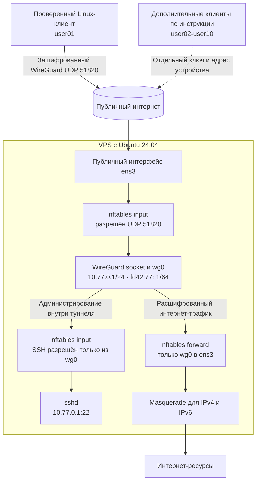

# Частный WireGuard VPN на VPS для 10 пользователей

[English](README.md) | **Русский**

Пошаговый runbook для Ubuntu 24.04 LTS: аренда VPS, защищённый SSH-доступ, маршрутизация IPv4/IPv6, firewall на `nftables`, WireGuard и отдельные конфигурации пользователей.

## Результат

После выполнения инструкции получится следующая схема:



Маршрут между VPN-клиентами намеренно отсутствует. На схеме отдельно показан проверенный `user01` и дополнительные клиенты, создание которых описано в инструкции.

В примерах используются:

- `203.0.113.10` — демонстрационный IP из диапазона документации; замените его реальным IPv4 VPS;
- `ens3` — внешний сетевой интерфейс; инструкция показывает, как определить его автоматически;
- `ubuntu` — стандартный административный пользователь образа Ubuntu;
- `user01` — первый VPN-пользователь;
- TCP 22 — SSH;
- UDP 51820 — WireGuard.

Никогда не публикуйте приватные SSH-ключи, WireGuard `private.key`, `preshared.key` или готовые клиентские `.conf`-файлы. Публичные ключи не являются секретом.

## 1. Требования к VPS

Для 10 пользователей обычно достаточно:

- 1–2 vCPU;
- 1–2 ГБ RAM;
- 20 ГБ SSD;
- публичного IPv4;
- рабочего IPv6, если нужен полноценный двухстековый VPN;
- сетевого порта от 200 Мбит/с;
- Ubuntu 24.04 LTS.

При выборе тарифа важнее лимит трафика и расположение дата-центра, чем объём RAM. Страна дата-центра станет страной выходного IP VPN. У провайдера разрешите TCP 22 для администрирования и UDP 51820 для WireGuard. После настройки желательно ограничить TCP 22 своим административным IP.

Не устанавливайте cPanel, Plesk, Docker-панели или готовые VPN-веб-интерфейсы, если они не нужны: каждый дополнительный сервис увеличивает поверхность атаки.

## 2. Создание защищённого SSH-ключа

Команды этого раздела выполняются на локальном компьютере.

Создайте отдельный ключ с понятным именем:

```bash
ssh-keygen \
  -t ed25519 \
  -a 64 \
  -f ~/.ssh/vpn_ovh_ed25519 \
  -C "vpn-ovh-admin"
```

Задайте парольную фразу и сохраните её в менеджере паролей. Она защищает локальный приватный ключ и не является паролем сервера.

Будут созданы:

```text
~/.ssh/vpn_ovh_ed25519       приватный ключ — секрет
~/.ssh/vpn_ovh_ed25519.pub   публичный ключ
```

Проверьте парольную фразу и целостность пары:

```bash
ssh-keygen -y -f ~/.ssh/vpn_ovh_ed25519 >/dev/null \
  && echo "SSH KEY OK"
```

Проверьте публичный ключ:

```bash
ssh-keygen -lf ~/.ssh/vpn_ovh_ed25519.pub
```

Публичная строка имеет такой формат:

```text
ssh-ed25519 AAAA... vpn-ovh-admin
```

Копировать в панель провайдера нужно всю строку без ручного редактирования.

## 3. Создание или переустановка VPS

В панели провайдера:

1. Добавьте публичный SSH-ключ с уникальным ID, например `vpn-protected`.
2. Создайте VPS либо переустановите пустой VPS.
3. Выберите Ubuntu 24.04 LTS.
4. В поле SSH key явно выберите `vpn-protected`, а не `None`.
5. Дождитесь состояния `Running` и уведомления об окончании установки.

Переустановка полностью удаляет содержимое VPS. Используйте её только для пустого сервера либо после резервного копирования.

Добавление ключа в общий список ключей провайдера само по себе не помещает его в уже установленную ОС. Ключ необходимо выбрать именно во время создания или переустановки VPS.

## 4. Первое SSH-подключение

На локальном компьютере задайте IP VPS:

```bash
export VPN_SERVER_IP="203.0.113.10"
export VPN_SSH_KEY="$HOME/.ssh/vpn_ovh_ed25519"
```

Подключитесь, разрешив SSH использовать только указанный ключ:

```bash
ssh \
  -o IdentitiesOnly=yes \
  -i "$VPN_SSH_KEY" \
  "ubuntu@$VPN_SERVER_IP"
```

При первом подключении сверьте отпечаток сервера с панелью провайдера, если она его показывает, затем ответьте `yes`. Введите парольную фразу локального ключа.

Проверьте систему и права:

```bash
whoami
lsb_release -ds
sudo true && echo "sudo OK"
```

Ожидается пользователь `ubuntu`, Ubuntu 24.04 LTS и `sudo OK`.

## 5. Обновление и установка пакетов

Дальнейшие команды до отдельного указания выполняются на VPS.

```bash
sudo apt update
sudo apt upgrade -y
sudo apt install -y wireguard wireguard-tools nftables qrencode
sudo reboot
```

После перезагрузки подключитесь заново и проверьте пакеты:

```bash
wg --version
nft --version
```

## 6. Определение интерфейсов и существующего firewall

Определите внешний интерфейс:

```bash
WAN_IF="$(ip -4 route show default | awk '{print $5; exit}')"
printf 'WAN interface: %s\n' "$WAN_IF"
```

Проверьте IPv6:

```bash
ip -6 route show default
```

Определите SSH-порт:

```bash
SSH_PORT="$(sudo sshd -T | awk '$1 == "port" {print $2; exit}')"
printf 'SSH port: %s\n' "$SSH_PORT"
```

Проверьте UFW и существующие правила:

```bash
sudo ufw status verbose
sudo nft list ruleset
sudo iptables -S
```

Эта инструкция предполагает новый сервер, где UFW имеет статус `inactive`, `nftables` пуст, а политики `iptables` равны `ACCEPT`. Если firewall уже содержит правила, не перезаписывайте его без анализа и миграции.

## 7. Включение маршрутизации

Повторно определите интерфейс на случай нового SSH-сеанса:

```bash
WAN_IF="$(ip -4 route show default | awk '{print $5; exit}')"
```

Создайте постоянные параметры ядра. Значение внешнего интерфейса подставится автоматически:

```bash
sudo tee /etc/sysctl.d/70-wireguard-routing.conf >/dev/null <<EOF
net.ipv4.ip_forward = 1
net.ipv6.conf.all.forwarding = 1
net.ipv6.conf.${WAN_IF}.accept_ra = 2
EOF
```

`accept_ra = 2` позволяет сохранить IPv6-маршрут, получаемый через Router Advertisement, когда сервер работает как IPv6-маршрутизатор.

Примените и проверьте:

```bash
sudo sysctl --system
sysctl net.ipv4.ip_forward
sysctl net.ipv6.conf.all.forwarding
ip -6 route show default
```

Оба параметра forwarding должны равняться `1`, а IPv6 default route должен сохраниться.

## 8. Настройка nftables

Повторно определите значения на случай нового SSH-сеанса:

```bash
WAN_IF="$(ip -4 route show default | awk '{print $5; exit}')"
SSH_PORT="$(sudo sshd -T | awk '$1 == "port" {print $2; exit}')"
printf 'WAN=%s SSH_PORT=%s\n' "$WAN_IF" "$SSH_PORT"
```

Создайте firewall. Значения `$WAN_IF` и `$SSH_PORT` подставятся текущей оболочкой:

```bash
sudo tee /etc/nftables.conf >/dev/null <<EOF
#!/usr/sbin/nft -f

flush ruleset

table inet vpn_filter {
    chain input {
        type filter hook input priority filter
        policy drop

        ct state invalid drop
        ct state established,related accept
        iifname "lo" accept

        meta l4proto icmp accept
        meta l4proto ipv6-icmp accept

        tcp dport ${SSH_PORT} accept
        udp dport 51820 accept
    }

    chain forward {
        type filter hook forward priority filter
        policy drop

        ct state invalid drop
        ct state established,related accept

        # Клиенты могут выходить в интернет через VPS.
        iifname "wg0" oifname "${WAN_IF}" accept

        # wg0 -> wg0 намеренно не разрешён:
        # VPN-пользователи изолированы друг от друга.
    }

    chain output {
        type filter hook output priority filter
        policy accept
    }
}

table ip vpn_nat {
    chain postrouting {
        type nat hook postrouting priority srcnat
        policy accept
        ip saddr 10.77.0.0/24 oifname "${WAN_IF}" masquerade
    }
}

table ip6 vpn_nat6 {
    chain postrouting {
        type nat hook postrouting priority srcnat
        policy accept
        ip6 saddr fd42:77::/64 oifname "${WAN_IF}" masquerade
    }
}
EOF
```

Сначала проверьте синтаксис без применения:

```bash
sudo nft --check --file /etc/nftables.conf
echo $?
```

Код `0` означает успешную проверку.

Не закрывая текущий SSH-сеанс, примените правила:

```bash
sudo nft --file /etc/nftables.conf
sudo nft list ruleset
```

Откройте второй локальный терминал и проверьте новое SSH-подключение. Первый сеанс держите открытым до успешной проверки. Если второе подключение работает, включите автозагрузку:

```bash
sudo systemctl enable nftables
sudo systemctl restart nftables
sudo systemctl is-enabled nftables
sudo systemctl is-active nftables
```

Ожидается `enabled` и `active`.

## 9. Ключ и интерфейс WireGuard на сервере

Создайте каталог и серверную пару ключей:

```bash
sudo install -d -m 700 /etc/wireguard/keys
sudo sh -c 'umask 077; wg genkey > /etc/wireguard/keys/server.key'
sudo sh -c 'wg pubkey < /etc/wireguard/keys/server.key > /etc/wireguard/keys/server.pub'
sudo chmod 600 /etc/wireguard/keys/server.key
sudo chmod 644 /etc/wireguard/keys/server.pub
```

Проверьте пару, выполняя перенаправления внутри root-оболочки:

```bash
sudo sh -c 'wg pubkey < /etc/wireguard/keys/server.key | diff - /etc/wireguard/keys/server.pub' \
  && echo "SERVER KEY OK"
```

Создайте интерфейс:

```bash
sudo tee /etc/wireguard/wg0.conf >/dev/null <<'EOF'
[Interface]
Address = 10.77.0.1/24, fd42:77::1/64
ListenPort = 51820
PostUp = wg set %i private-key /etc/wireguard/keys/server.key
EOF

sudo chmod 600 /etc/wireguard/wg0.conf
sudo systemctl enable --now wg-quick@wg0
```

Проверьте:

```bash
sudo systemctl is-active wg-quick@wg0
ip -brief address show wg0
sudo wg show
```

Интерфейс должен иметь `10.77.0.1/24`, `fd42:77::1/64` и слушать UDP 51820.

## 10. Создание первого пользователя

Ключи клиента создаются на локальном компьютере, чтобы его приватный ключ никогда не попадал на VPS.

Если `wg` отсутствует на локальном Ubuntu-компьютере, установите инструменты:

```bash
sudo apt update
sudo apt install -y wireguard-tools qrencode
```

```bash
install -d -m 700 ~/vpn/clients/user01
umask 077
wg genkey > ~/vpn/clients/user01/private.key
wg pubkey \
  < ~/vpn/clients/user01/private.key \
  > ~/vpn/clients/user01/public.key
wg genpsk > ~/vpn/clients/user01/preshared.key
```

Все три файла должны иметь права `600`:

```bash
stat -c '%a %n' ~/vpn/clients/user01/*.key
```

Передайте VPS только публичный и preshared-ключи:

```bash
ssh \
  -o IdentitiesOnly=yes \
  -i "$VPN_SSH_KEY" \
  "ubuntu@$VPN_SERVER_IP" \
  'install -d -m 700 /tmp/user01'

scp \
  -o IdentitiesOnly=yes \
  -i "$VPN_SSH_KEY" \
  ~/vpn/clients/user01/public.key \
  ~/vpn/clients/user01/preshared.key \
  "ubuntu@$VPN_SERVER_IP:/tmp/user01/"
```

На VPS сохраните их под `root`:

```bash
sudo install -d -m 700 /etc/wireguard/peers/user01
sudo install -m 600 /tmp/user01/public.key /etc/wireguard/peers/user01/public.key
sudo install -m 600 /tmp/user01/preshared.key /etc/wireguard/peers/user01/preshared.key
rm -f /tmp/user01/public.key /tmp/user01/preshared.key
rmdir /tmp/user01
sudo ls -la /etc/wireguard/peers/user01
```

Добавьте peer, не выводя ключи на экран:

```bash
sudo cp -a /etc/wireguard/wg0.conf /etc/wireguard/wg0.conf.before-user01

sudo sh -c '
PUBLIC_KEY=$(cat /etc/wireguard/peers/user01/public.key)
PRESHARED_KEY=$(cat /etc/wireguard/peers/user01/preshared.key)

printf "\n[Peer]\n# user01\nPublicKey = %s\nPresharedKey = %s\nAllowedIPs = 10.77.0.2/32, fd42:77::2/128\n" \
  "$PUBLIC_KEY" "$PRESHARED_KEY" >> /etc/wireguard/wg0.conf
'

sudo systemctl restart wg-quick@wg0
sudo wg show
```

До первого подключения `latest handshake` отсутствует — это нормально.

## 11. Клиентская конфигурация

На локальном компьютере получите публичный ключ сервера безопасным способом:

```bash
SERVER_PUBLIC_KEY="$(
  ssh -o IdentitiesOnly=yes -i "$VPN_SSH_KEY" \
    "ubuntu@$VPN_SERVER_IP" \
    'sudo cat /etc/wireguard/keys/server.pub'
)"
```

Соберите конфигурацию без вывода секретов:

```bash
umask 077
CLIENT_PRIVATE_KEY="$(cat ~/vpn/clients/user01/private.key)"
PRESHARED_KEY="$(cat ~/vpn/clients/user01/preshared.key)"

cat > ~/vpn/clients/user01/user01.conf <<EOF
[Interface]
PrivateKey = ${CLIENT_PRIVATE_KEY}
Address = 10.77.0.2/32, fd42:77::2/128
DNS = 1.1.1.1, 9.9.9.9
MTU = 1380

[Peer]
PublicKey = ${SERVER_PUBLIC_KEY}
PresharedKey = ${PRESHARED_KEY}
Endpoint = ${VPN_SERVER_IP}:51820
AllowedIPs = 0.0.0.0/0, ::/0
PersistentKeepalive = 25
EOF

unset CLIENT_PRIVATE_KEY PRESHARED_KEY SERVER_PUBLIC_KEY
chmod 600 ~/vpn/clients/user01/user01.conf
```

Значение `AllowedIPs = 0.0.0.0/0, ::/0` направляет через VPN весь IPv4- и IPv6-трафик. `PersistentKeepalive = 25` помогает клиентам за NAT и мобильными сетями.

Проверьте конфигурацию, не печатая её:

```bash
wg-quick strip ~/vpn/clients/user01/user01.conf >/dev/null \
  && echo "CLIENT CONFIG OK"
```

## 12. Подключение на Ubuntu через NetworkManager

Импортируйте конфигурацию:

```bash
sudo nmcli connection import \
  type wireguard \
  file ~/vpn/clients/user01/user01.conf
```

Отключите автоматический запуск на время проверки:

```bash
sudo nmcli connection modify user01 connection.autoconnect no
```

Подключите VPN:

```bash
sudo nmcli connection up user01
```

Если интернет пропал, отключите туннель:

```bash
sudo nmcli connection down user01
```

Проверьте туннель и внешние адреса:

```bash
ping -c 3 10.77.0.1
curl -4 https://ifconfig.me
echo
curl -6 --max-time 10 https://ifconfig.me
echo
sudo wg show
```

IPv4 должен совпасть с публичным IPv4 VPS. IPv6 должен относиться к подсети VPS. В `wg show` должны появиться свежий `latest handshake` и ненулевой `transfer`.

## 13. Настройка отдельного клиента для iPhone

Для каждого устройства требуется отдельный WireGuard peer. Не импортируйте `user01.conf` одновременно на ноутбук и iPhone: одинаковые ключи и адреса на двух активных устройствах будут конфликтовать. В этом примере iPhone получает имя `user02`, IPv4 `10.77.0.3` и IPv6 `fd42:77::3`.

### 13.1. Установка приложения

Установите на iPhone официальное бесплатное приложение [WireGuard из App Store](https://apps.apple.com/us/app/wireguard/id1441195209). Проверьте, что продавец указан как WireGuard LLC или WireGuard Development Team. Приложению требуется iOS 15 или новее.

### 13.2. Ключи iPhone

Команды выполняются на локальном Ubuntu-компьютере:

```bash
install -d -m 700 ~/vpn/clients/user02
umask 077

wg genkey > ~/vpn/clients/user02/private.key
wg pubkey \
  < ~/vpn/clients/user02/private.key \
  > ~/vpn/clients/user02/public.key
wg genpsk > ~/vpn/clients/user02/preshared.key

stat -c '%a %n' ~/vpn/clients/user02/*.key
```

Все три файла должны иметь права `600`. Если `user02` уже существует, не запускайте генерацию повторно: сначала определите, используется ли существующий peer, либо выберите следующее свободное имя и адрес.

### 13.3. Передача разрешённых ключей

На локальном компьютере задайте переменные, если они отсутствуют в текущем терминале:

```bash
export VPN_SERVER_IP="203.0.113.10"
export VPN_SSH_KEY="$HOME/.ssh/vpn_ovh_ed25519"
```

Замените демонстрационный IP реальным адресом VPS.

Создайте временный закрытый каталог и передайте только публичный и preshared-ключи. Приватный ключ iPhone остаётся локально:

```bash
ssh \
  -o IdentitiesOnly=yes \
  -i "$VPN_SSH_KEY" \
  "ubuntu@$VPN_SERVER_IP" \
  'install -d -m 700 /tmp/user02'

scp \
  -o IdentitiesOnly=yes \
  -i "$VPN_SSH_KEY" \
  ~/vpn/clients/user02/public.key \
  ~/vpn/clients/user02/preshared.key \
  "ubuntu@$VPN_SERVER_IP:/tmp/user02/"
```

Подключитесь к VPS:

```bash
ssh \
  -o IdentitiesOnly=yes \
  -i "$VPN_SSH_KEY" \
  "ubuntu@$VPN_SERVER_IP"
```

На VPS сохраните ключи под владельцем `root`:

```bash
sudo install -d -m 700 /etc/wireguard/peers/user02
sudo install -m 600 /tmp/user02/public.key /etc/wireguard/peers/user02/public.key
sudo install -m 600 /tmp/user02/preshared.key /etc/wireguard/peers/user02/preshared.key
```

Создайте резервную копию и добавьте peer:

```bash
sudo cp -a /etc/wireguard/wg0.conf /etc/wireguard/wg0.conf.before-user02

sudo sh -c '
PUBLIC_KEY=$(cat /etc/wireguard/peers/user02/public.key)
PRESHARED_KEY=$(cat /etc/wireguard/peers/user02/preshared.key)

printf "\n[Peer]\n# user02-iPhone\nPublicKey = %s\nPresharedKey = %s\nAllowedIPs = 10.77.0.3/32, fd42:77::3/128\n" \
  "$PUBLIC_KEY" "$PRESHARED_KEY" >> /etc/wireguard/wg0.conf
'
```

Удалите временные копии, примените конфигурацию и проверьте второй peer:

```bash
rm -f /tmp/user02/public.key /tmp/user02/preshared.key
rmdir /tmp/user02

sudo systemctl restart wg-quick@wg0
sudo systemctl is-active wg-quick@wg0
sudo wg show
```

В выводе должен присутствовать peer с `AllowedIPs = 10.77.0.3/32, fd42:77::3/128`. До подключения телефона handshake отсутствует.

### 13.4. Конфигурация и QR-код

Выйдите с VPS командой `exit`. Далее команды снова выполняются на локальном компьютере.

Получите публичный ключ сервера:

```bash
SERVER_PUBLIC_KEY="$(
  ssh \
    -o IdentitiesOnly=yes \
    -i "$VPN_SSH_KEY" \
    "ubuntu@$VPN_SERVER_IP" \
    'sudo cat /etc/wireguard/keys/server.pub'
)"
```

Соберите конфигурацию iPhone:

```bash
umask 077
CLIENT_PRIVATE_KEY="$(cat ~/vpn/clients/user02/private.key)"
PRESHARED_KEY="$(cat ~/vpn/clients/user02/preshared.key)"

cat > ~/vpn/clients/user02/user02-iPhone.conf <<EOF
[Interface]
PrivateKey = ${CLIENT_PRIVATE_KEY}
Address = 10.77.0.3/32, fd42:77::3/128
DNS = 1.1.1.1, 9.9.9.9
MTU = 1380

[Peer]
PublicKey = ${SERVER_PUBLIC_KEY}
PresharedKey = ${PRESHARED_KEY}
Endpoint = ${VPN_SERVER_IP}:51820
AllowedIPs = 0.0.0.0/0, ::/0
PersistentKeepalive = 25
EOF

unset CLIENT_PRIVATE_KEY PRESHARED_KEY SERVER_PUBLIC_KEY
chmod 600 ~/vpn/clients/user02/user02-iPhone.conf

wg-quick strip ~/vpn/clients/user02/user02-iPhone.conf >/dev/null \
  && echo "IPHONE CONFIG OK"
```

Установите генератор QR, если он отсутствует, и покажите код на экране:

```bash
sudo apt install -y qrencode
qrencode -t ansiutf8 -m 2 \
  < ~/vpn/clients/user02/user02-iPhone.conf
```

QR-код содержит приватный и preshared-ключи. Не фотографируйте, не публикуйте и не отправляйте его через обычные мессенджеры. Храните `.conf` как секрет или поместите резервную копию в зашифрованное хранилище.

### 13.5. Импорт и проверка на iPhone

В приложении WireGuard:

1. Нажмите `Add a tunnel` или `+`.
2. Выберите `Create from QR code`.
3. Разрешите приложению доступ к камере.
4. Отсканируйте QR-код с монитора.
5. Назовите туннель `Private VPN`.
6. Разрешите iOS добавить VPN-конфигурацию и подтвердите действие кодом устройства или Face ID.
7. Включите переключатель туннеля.

Сначала отключите Wi-Fi и проверьте VPN через мобильную сеть, затем повторите проверку через Wi-Fi. В Safari откройте `https://ifconfig.me`: должен отображаться публичный IPv4 VPS.

На VPS проверьте:

```bash
sudo wg show
```

У peer `user02` должны появиться свежий `latest handshake` и ненулевой `transfer`.

После успешного ручного теста можно открыть настройки туннеля на iPhone и включить `On-Demand Activation` для Wi-Fi и Cellular. При необходимости добавьте доверенную домашнюю Wi-Fi-сеть в исключения. Сначала проверьте On-Demand отдельно на Wi-Fi и мобильной сети, чтобы не остаться без доступа к интернету при ошибке конфигурации.

## 14. Ежедневное включение и выключение

Включить VPN:

```bash
sudo nmcli connection up user01
```

Выключить VPN:

```bash
sudo nmcli connection down user01
```

Проверить активные подключения:

```bash
nmcli connection show --active
```

Проверить автозапуск:

```bash
nmcli -g connection.autoconnect connection show user01
```

Разрешить или запретить автозапуск:

```bash
sudo nmcli connection modify user01 connection.autoconnect yes
sudo nmcli connection modify user01 connection.autoconnect no
```

В Ubuntu Desktop тот же профиль доступен через системное сетевое меню в разделе VPN. Закрытие терминала не отключает VPN.

## 15. Добавление пользователей 02–10

Для каждого устройства создавайте отдельную пару ключей, отдельный preshared-ключ и уникальные адреса. Не используйте один клиентский конфиг одновременно на нескольких устройствах.

Рекомендуемая адресация:

| Пользователь | IPv4 | IPv6 |
|---|---|---|
| user01 | `10.77.0.2/32` | `fd42:77::2/128` |
| user02 | `10.77.0.3/32` | `fd42:77::3/128` |
| user03 | `10.77.0.4/32` | `fd42:77::4/128` |
| ... | ... | ... |
| user10 | `10.77.0.11/32` | `fd42:77::b/128` |

Повторите разделы 10 и 11, меняя имя и адреса. На сервере каждый peer должен иметь только свои `/32` и `/128`. После изменения `/etc/wireguard/wg0.conf` применяйте:

```bash
sudo systemctl restart wg-quick@wg0
sudo wg show
```

Для телефона покажите QR-код только владельцу конфигурации:

```bash
qrencode -t ansiutf8 < ~/vpn/clients/user01/user01.conf
```

Если команда `qrencode` отсутствует на локальном компьютере, установите пакет `qrencode`. QR-код содержит приватный ключ и должен считаться секретом.

## 16. Отзыв доступа пользователя

Чтобы отключить потерянное или скомпрометированное устройство:

1. Создайте резервную копию `/etc/wireguard/wg0.conf`.
2. Удалите соответствующий блок `[Peer]` из серверного файла.
3. Перезапустите WireGuard.
4. Проверьте, что peer исчез.

```bash
sudo cp -a /etc/wireguard/wg0.conf /etc/wireguard/wg0.conf.backup
sudoedit /etc/wireguard/wg0.conf
sudo systemctl restart wg-quick@wg0
sudo wg show
```

Не назначайте адрес отозванного пользователя новому устройству, пока старый peer не удалён и изменение не применено.

## 17. Проверки после перезагрузки

```bash
sudo reboot
```

После повторного подключения:

```bash
sudo systemctl is-active nftables
sudo systemctl is-active wg-quick@wg0
sysctl net.ipv4.ip_forward
sysctl net.ipv6.conf.all.forwarding
ip -6 route show default
sudo wg show
```

Затем подключите клиента и снова проверьте IPv4, IPv6 и handshake.

## 18. Типичные ошибки

### `Too many authentication failures`

SSH-agent предлагает серверу много ключей. Укажите один ключ явно:

```bash
ssh \
  -o IdentitiesOnly=yes \
  -i ~/.ssh/vpn_ovh_ed25519 \
  ubuntu@203.0.113.10
```

### `Identity file ... not accessible`

Указан несуществующий путь. Найдите ключи:

```bash
find ~/.ssh -maxdepth 1 -type f -printf '%f\n'
```

Используйте файл без `.pub` как `IdentityFile`.

### Сервер спрашивает `ubuntu@IP's password`

Это пароль пользователя на сервере, а не парольная фраза SSH-ключа. Обычно это означает, что публичный ключ не установлен для данного пользователя. Проверьте имя пользователя и ключ, выбранный при установке VPS.

### `Enter passphrase for key ...`

Это запрос пароля локального приватного ключа. Если проверка `ssh-keygen -y -f KEY` проходит, парольная фраза верна.

### `Permission denied (publickey,password)`

Указанный приватный ключ не соответствует публичному ключу на сервере либо выбран неправильный пользователь. На пустом VPS наиболее простой способ исправления — переустановка с явно выбранным правильным публичным ключом.

### `Permission denied` при `< /etc/wireguard/...`

Перенаправление выполняет текущая оболочка до `sudo`. Выполните всю конструкцию через root-оболочку:

```bash
sudo sh -c 'wg pubkey < /etc/wireguard/keys/server.key'
```

То же относится к wildcard в закрытом каталоге:

```bash
sudo sh -c "stat -c '%a %U:%G %n' /etc/wireguard/peers/user01/*.key"
```

### Handshake отсутствует

Проверьте:

```bash
sudo wg show
sudo nft list ruleset
sudo ss -lun | grep 51820
```

Убедитесь, что UDP 51820 разрешён также во внешнем firewall провайдера, endpoint содержит правильный публичный IP, а публичные и preshared-ключи совпадают на обеих сторонах.

### Handshake есть, но интернета нет

Проверьте forwarding, NAT и маршруты:

```bash
sysctl net.ipv4.ip_forward
sysctl net.ipv6.conf.all.forwarding
sudo nft list ruleset
ip route
ip -6 route
```

### Изменился SSH host key после переустановки

Если переустановка была инициирована вами и завершилась успешно, удалите старую запись:

```bash
ssh-keygen -R 203.0.113.10
```

При следующем подключении по возможности снова сверьте новый отпечаток.

## 19. Эксплуатационные рекомендации

- Храните клиентские конфиги и ключи в каталоге с правами `700`, файлы — `600`.
- Делайте резервную копию `/etc/wireguard/wg0.conf` перед изменениями.
- Не включайте подробное логирование пользовательского трафика без явной необходимости и согласия пользователей.
- Регулярно устанавливайте обновления безопасности Ubuntu.
- Ограничьте SSH своим IP во внешнем firewall провайдера.
- Не открывайте веб-панель управления VPN в интернет без отдельной аутентификации и защиты.
- Учитывайте правила провайдера: действия пользователей будут связаны с владельцем VPS и его публичным IP.
- VPS скрывает трафик от локальной Wi-Fi-сети, но не делает пользователя анонимным: провайдер VPS видит метаданные, а сайты видят IP дата-центра.

## 20. Усиление приватности и анонимности

VPN защищает трафик между клиентом и VPS, скрывает его от локальной Wi-Fi-сети и заменяет клиентский публичный IP адресом сервера. Однако личный VPS не обеспечивает абсолютную анонимность:

- аккаунт и оплата VPS могут быть связаны с владельцем;
- провайдер VPS видит время соединений, объём трафика и сетевые метаданные;
- сайты видят постоянный IP дата-центра;
- авторизация в личном аккаунте раскрывает сайту личность независимо от VPN;
- cookies и browser fingerprint позволяют связывать сеансы.

### 20.1. Временные системные журналы

Все команды этого подраздела выполняются **на VPS через SSH**, где приглашение выглядит как `ubuntu@vps-...:~$`.

WireGuard в описанной конфигурации не записывает историю посещённых сайтов, а правила `nftables` не содержат действий `log`. При этом Ubuntu может постоянно хранить системные события, сообщения служб и попытки SSH-входа.

Сначала выполните только проверку:

```bash
sudo journalctl --disk-usage
sudo systemctl is-active rsyslog
sudo test -d /var/log/journal \
  && echo "persistent journal exists" \
  || echo "persistent journal directory absent"
```

`journalctl --disk-usage` ничего не изменяет — команда только показывает объём журналов.

Разумный баланс приватности и безопасности — хранить journal только в RAM не более суток. Создайте drop-in:

```bash
sudo install -d -m 755 /etc/systemd/journald.conf.d

sudo tee /etc/systemd/journald.conf.d/60-vpn-privacy.conf >/dev/null <<'EOF'
[Journal]
Storage=volatile
RuntimeMaxUse=64M
RuntimeMaxFileSize=8M
MaxRetentionSec=1day
ForwardToSyslog=no
EOF
```

Проверьте итоговую конфигурацию:

```bash
sudo systemd-analyze cat-config systemd/journald.conf
```

Примените настройку:

```bash
sudo systemctl restart systemd-journald
```

После этого новые записи journal хранятся в `/run/log/journal`, то есть в оперативной памяти, и исчезают при перезагрузке. Лимит `MaxRetentionSec=1day` дополнительно ограничивает срок хранения в рамках текущего запуска.

Если `rsyslog` имеет статус `active`, он может отдельно создавать постоянные файлы, например `/var/log/auth.log`. Для режима без новых постоянных syslog-файлов его можно отключить:

```bash
sudo systemctl disable --now rsyslog
```

Отключение `rsyslog` и volatile journal уменьшают возможности расследовать взлом или технический сбой. Режим `Storage=none` для обычного частного VPN не рекомендуется: в нём пропадает даже краткосрочная диагностика.

Важно: изменение `Storage=volatile` не удаляет журналы, уже записанные на диск. Их удаление является отдельным необратимым действием и должно выполняться только после проверки требований провайдера, законодательства и необходимости сохранить данные для диагностики. Поведение `Storage=volatile`, `Storage=none` и `MaxRetentionSec` описано в [официальной документации systemd](https://www.freedesktop.org/software/systemd/man/252/journald.conf.html).

### 20.2. Автоматические обновления безопасности

Команды выполняются **на VPS через SSH**.

Установите механизм автоматических обновлений:

```bash
sudo apt update
sudo apt install -y unattended-upgrades
```

Убедитесь, что ежедневное обновление списков и установка обновлений включены:

```bash
sudo tee /etc/apt/apt.conf.d/20auto-upgrades >/dev/null <<'EOF'
APT::Periodic::Update-Package-Lists "1";
APT::Periodic::Unattended-Upgrade "1";
EOF
```

Проверьте конфигурацию и системные таймеры:

```bash
apt-config dump | grep -E 'APT::Periodic::(Update-Package-Lists|Unattended-Upgrade)'
systemctl list-timers apt-daily.timer apt-daily-upgrade.timer
```

Значение `1` означает выполнение раз в день. Ubuntu 24.04 обычно устанавливает и включает `unattended-upgrades` по умолчанию, но явная проверка исключает зависимость от конкретного образа VPS. По умолчанию автоматически применяются обновления безопасности из официальных репозиториев Ubuntu; автоматическая перезагрузка выключена. Подробности приведены в [официальной инструкции Ubuntu по автоматическим обновлениям](https://documentation.ubuntu.com/server/how-to/software/automatic-updates/).

Периодически проверяйте доступные обновления вручную:

```bash
sudo apt update
apt list --upgradable
```

После обновлений ядра планируйте перезагрузку и проверяйте `nftables`, `wg-quick@wg0`, IPv4/IPv6 forwarding и клиентский handshake по разделу 17. Автоматическую перезагрузку лучше не включать, пока не проверены recovery-консоль и восстановление всех служб после ручного reboot.

### 20.3. VPN, браузер и Tor

Обычный браузер через VPN не становится анонимным. Сайт всё ещё может распознать пользователя по:

- cookies и local storage;
- входу в Google, Telegram, социальные сети или почту;
- номеру телефона, имени и email в формах;
- browser fingerprint: версия браузера, шрифты, язык, часовой пояс, размер экрана и графический стек;
- дополнительным расширениям браузера.

Для обычной приватности достаточно WireGuard, HTTPS, обновлённого браузера и блокировки сторонних трекеров. Для чувствительного анонимного веб-сеанса лучше использовать отдельный официальный Tor Browser:

- не входить в личные аккаунты;
- не вводить личные email, телефон или имя;
- не устанавливать дополнительные расширения;
- не менять без необходимости размеры окна и другие параметры, влияющие на fingerprint;
- при повышенном риске выбрать уровень безопасности `Safer` или `Safest`;
- не использовать BitTorrent через Tor.

Tor Browser направляет через Tor только собственный трафик, а не весь трафик операционной системы. Даже Tor Project подчёркивает, что абсолютной анонимности не существует. См. [рекомендации по безопасному использованию Tor Browser](https://support.torproject.org/tor-browser/security/using-tb-safely/) и [описание уровней безопасности](https://support.torproject.org/tor-browser/features/security-levels/).

Не следует автоматически считать цепочку `VPN → Tor` более анонимной. Неправильная комбинация усложняет модель доверия и может уменьшить приватность. Tor Project рекомендует совмещать VPN и Tor только опытным пользователям, понимающим конкретную конфигурацию и угрозы. См. [официальное пояснение Tor Browser о VPN](https://support.torproject.org/tor-browser/general/vpn-with-tor/).

Практическое разделение:

- WireGuard — постоянная защита трафика в публичных сетях и единый IP VPS;
- обычный браузер через WireGuard — приватность соединения, но не анонимность от сайтов;
- Tor Browser отдельным сеансом — более сильная защита личности и fingerprint для чувствительного веб-доступа;
- отсутствие личных авторизаций и раздельное поведение важнее добавления новых сетевых «слоёв».

## 21. Полезные команды

Состояние WireGuard:

```bash
sudo wg show
```

Журнал службы:

```bash
sudo journalctl -u wg-quick@wg0 --no-pager
```

Активные правила:

```bash
sudo nft list ruleset
```

Перезапуск WireGuard:

```bash
sudo systemctl restart wg-quick@wg0
```

Проверка внешних адресов клиента:

```bash
curl -4 https://ifconfig.me
echo
curl -6 --max-time 10 https://ifconfig.me
echo
```

## 22. Усиление после запуска

Переходите к этому разделу только после того, как `user01` получил handshake, рабочий IPv4/IPv6 и проверенное SSH-подключение к `ubuntu@10.77.0.1`. Во время изменения SSH и firewall оставляйте существующий SSH-сеанс открытым.

### 22.1. Только SSH-ключи

На VPS создайте ранний drop-in OpenSSH:

```bash
sudo tee /etc/ssh/sshd_config.d/00-vpn-hardening.conf >/dev/null <<'EOF'
PubkeyAuthentication yes
PasswordAuthentication no
KbdInteractiveAuthentication no
PermitRootLogin no
MaxAuthTries 3
AllowUsers ubuntu
EOF
```

Проверьте конфигурацию до перезагрузки службы:

```bash
sudo sshd -t && echo "SSH CONFIG OK"
sudo systemctl reload ssh

sudo sshd -T | awk '
$1 == "pubkeyauthentication" ||
$1 == "passwordauthentication" ||
$1 == "kbdinteractiveauthentication" ||
$1 == "permitrootlogin" ||
$1 == "maxauthtries" ||
$1 == "allowusers" {print}
'
```

Ожидаются `pubkeyauthentication yes`, оба парольных метода со значением `no`, `permitrootlogin no`, `maxauthtries 3` и `allowusers ubuntu`. До закрытия исходного сеанса откройте второй терминал и проверьте вход только по ключу.

### 22.2. SSH только внутри WireGuard

Сначала проверьте закрытый административный маршрут с Linux-клиента:

```bash
ssh \
  -o IdentitiesOnly=yes \
  -i ~/.ssh/vpn_ovh_ed25519 \
  ubuntu@10.77.0.1
```

Если подключение не работает, не ограничивайте порт 22. После изменения сбой WireGuard также заблокирует SSH, поэтому должна быть доступна recovery-консоль провайдера либо нужно принять риск переустановки VPS.

На VPS создайте резервную копию firewall и временный автоматический откат:

```bash
sudo cp -a /etc/nftables.conf /etc/nftables.conf.before-ssh-wg-only

sudo systemd-run \
  --unit=nft-ssh-rollback \
  --on-active=15m \
  /bin/sh -c \
  'cp /etc/nftables.conf.before-ssh-wg-only /etc/nftables.conf && nft --file /etc/nftables.conf'
```

Замените публичное правило SSH правилом для интерфейса WireGuard:

```bash
sudo sed -i \
  's/^[[:space:]]*tcp dport 22 accept/        iifname "wg0" tcp dport 22 accept/' \
  /etc/nftables.conf

sudo nft --check --file /etc/nftables.conf &&
sudo nft --file /etc/nftables.conf

sudo nft list chain inet vpn_filter input
```

Откройте ещё один новый SSH-сеанс к `ubuntu@10.77.0.1`. Только после успешного входа отмените откат:

```bash
sudo systemctl stop nft-ssh-rollback.timer
sudo systemctl is-active nft-ssh-rollback.timer
```

Таймер должен иметь статус `inactive`. Теперь TCP 22 доступен через `wg0`, а UDP 51820 остаётся доступным публично.

### 22.3. Постоянный kill switch на Linux

Команды выполняются на локальном Ubuntu-клиенте. Kill switch блокирует IPv4 и IPv6 хоста при недоступности `user01`, но разрешает WireGuard связаться со своим endpoint.

До начала проверьте существующий локальный firewall. Не заменяйте действующую конфигурацию без безопасной интеграции новой таблицы.

Получите endpoint и создайте отдельный файл nftables:

```bash
VPN_ENDPOINT="$(
  sudo wg show user01 endpoints |
  awk '{sub(/:[0-9]+$/, "", $2); print $2}'
)"

printf 'WireGuard endpoint: %s\n' "$VPN_ENDPOINT"
sudo install -d -m 755 /etc/nftables.d

sudo tee /etc/nftables.d/vpn-killswitch.nft >/dev/null <<EOF
table inet vpn_killswitch {
    chain output {
        type filter hook output priority -10
        policy accept

        oifname "lo" accept
        oifname "user01" accept

        ip daddr ${VPN_ENDPOINT} udp dport 51820 accept

        udp sport 68 udp dport 67 accept
        udp sport 546 udp dport 547 accept
        icmpv6 type {
            nd-router-solicit,
            nd-router-advert,
            nd-neighbor-solicit,
            nd-neighbor-advert
        } accept

        fib daddr type local accept
        counter reject with icmpx type admin-prohibited
    }
}
EOF

sudo nft --check --file /etc/nftables.d/vpn-killswitch.nft
sudo nft --file /etc/nftables.d/vpn-killswitch.nft
```

Добавьте одну строку include в существующую конфигурацию nftables для загрузки таблицы после перезагрузки. Не перезагружайте весь ruleset, пока не проверено его взаимодействие с другими локальными firewall:

```bash
sudo grep -qxF \
  'include "/etc/nftables.d/vpn-killswitch.nft"' \
  /etc/nftables.conf ||
printf '\ninclude "/etc/nftables.d/vpn-killswitch.nft"\n' |
sudo tee -a /etc/nftables.conf >/dev/null

sudo nft --check --file /etc/nftables.conf
```

Создайте явные команды управления. `vpn-on` сначала включает kill switch, затем WireGuard. `vpn-off` намеренно отключает обе защиты, чтобы работал обычный интернет:

```bash
sudo tee /usr/local/sbin/vpn-on >/dev/null <<'EOF'
#!/bin/sh
set -eu

if ! /usr/sbin/nft list table inet vpn_killswitch >/dev/null 2>&1; then
    /usr/sbin/nft --file /etc/nftables.d/vpn-killswitch.nft
fi

/usr/bin/nmcli connection up user01
EOF

sudo tee /usr/local/sbin/vpn-off >/dev/null <<'EOF'
#!/bin/sh
set -eu

/usr/bin/nmcli connection down user01 || true

if /usr/sbin/nft list table inet vpn_killswitch >/dev/null 2>&1; then
    /usr/sbin/nft delete table inet vpn_killswitch
fi
EOF

sudo chmod 755 /usr/local/sbin/vpn-on /usr/local/sbin/vpn-off
sudo sh -n /usr/local/sbin/vpn-on
sudo sh -n /usr/local/sbin/vpn-off
```

Ежедневные команды:

```bash
sudo vpn-on
sudo vpn-off
```

Не используйте только `nmcli connection down user01` при активном kill switch: обычный интернет останется заблокирован намеренно. Аварийная команда:

```bash
sudo nft delete table inet vpn_killswitch
```

### 22.4. Проверка утечек и восстановления

При активном VPN убедитесь, что оба адреса принадлежат VPS:

```bash
curl -4 --max-time 10 https://ifconfig.me
echo
curl -6 --max-time 10 https://ifconfig.me
echo
```

Для имитации сбоя отключите только туннель. Оба запроса должны завершиться ошибкой с ненулевым кодом:

```bash
sudo nmcli connection down user01

curl -4 --max-time 5 https://ifconfig.me
echo "IPv4 exit: $?"
curl -6 --max-time 5 https://ifconfig.me
echo "IPv6 exit: $?"

sudo nmcli connection up user01
```

В браузере выполните DNS leak test и WebRTC test. DNS-серверы могут принадлежать настроенному публичному резолверу, но не локальному провайдеру. WebRTC не должен показывать домашний публичный адрес.

В завершение перезагрузите VPS и проверьте `nftables`, `wg-quick@wg0`, forwarding и свежий handshake. Перезагрузите клиент и убедитесь, что таблица kill switch загружается до выполнения `sudo vpn-on`.

## 23. Официальная документация

- [WireGuard Quick Start](https://www.wireguard.com/quickstart/)
- [Установка WireGuard](https://www.wireguard.com/install/)
- [Ubuntu: WireGuard как default gateway](https://ubuntu.com/server/docs/how-to/wireguard-vpn/vpn-as-the-default-gateway/)
- [Ubuntu: firewall и masquerading](https://documentation.ubuntu.com/server/how-to/security/firewalls/)
- [OVHcloud: SSH-ключи](https://help.ovhcloud.com/csm/en-sg-dedicated-servers-creating-ssh-keys?id=kb_article_view&sysparm_article=KB0043379)
